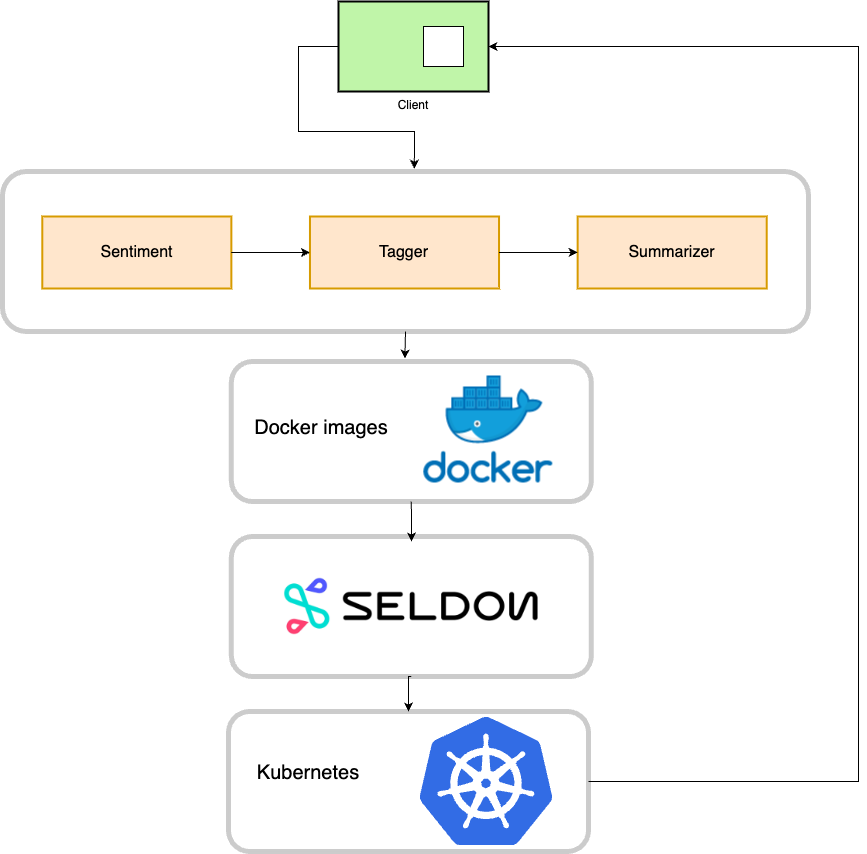

# ml-models-k8-serving
Serving Machine Learning Pipeline with Seldon Core on Kubernetes
<p align="center">
  
</p>
Barebones microservices setup, input text is entered to get predictions from sequence of Machine Learning models deployed as a pipeline.

1. Set-up barebones Kubernetes cluster 

2. Install [Seldon-core](https://docs.seldon.io/projects/seldon-core/en/latest/charts/seldon-core-operator.html) and [Istio](https://istio.io/latest/docs/setup/install/helm/)

3. Deploy pipeline
```bash
$ helm install seldon charts/
SeldonDeployment.yaml -n seldon-model
seldondeployment.machinelearning.seldon.io/seldon-pipeline created

$ kubectl get pods -n seldon-model 
NAME                                                       READY   STATUS    RESTARTS   AGE
seldon-c4888704f0b4934a7cbd2df09d86d3da-7d49f9df49-g9kbh   1/1     Running   0          119s
```

4. Test CURL
```bash
$ export INGRESS_HOST=$(kubectl -n istio-system get service istio-ingressgateway -o jsonpath='{.status.loadBalancer.ingress[0].ip}')

$ curl -X POST -d @payload.json -H 'Content-Type: application/json' \
    http://$INGRESS_HOST/seldon/seldon-model/seldon-pipeline/api/v1.0/predictions | json_pp

{
    "data": {
        "names": [],
        "ndarray": [
            "In an attempt to build an AI-ready workforce, Microsoft announced Intelligent Cloud Hub which has been launched to empower the next generation of students with AI-ready skills. Envisioned as a three-year collaborative program, Intelligent Cloud Hub will support around 100 institutions with AI infrastructure, course content and curriculum, developer support, development tools and give students access to cloud and AI services. As part of the program, the Redmond giant which wants to expand its reach and is planning to build a strong developer ecosystem in India with the program will set up the core AI infrastructure and IoT Hub for the selected campuses. The company will provide AI development tools and Azure AI services such as Microsoft Cognitive Services, Bot Services and Azure Machine Learning. According to Manish Prakash, Country General Manager-PS, Health and Education, Microsoft India, said, With AI being the defining technology of our time, it is transforming lives and industry and the jobs of tomorrow will require a different skillset. This will require more collaborations and training and working with AI. That’s why it has become more critical than ever for educational institutions to integrate new cloud and AI technologies. The program is an attempt to ramp up the institutional set-up and build capabilities among the educators to educate the workforce of tomorrow. The program aims to build up the cognitive skills and in-depth understanding of developing intelligent cloud connected solutions for applications across industry. Earlier in April this year, the company announced Microsoft Professional Program In AI as a learning track open to the public. The program was developed to provide job ready skills to programmers who wanted to hone their skills in AI and data science with a series of online courses which featured hands-on labs and expert instructors as well. This program also included developer-focused AI school that provided a bunch of assets to help build AI skills"
        ]
    },
    "meta": {
        "requestPath": {
            "sentiment": "mingboiz/seldon-sentiment:v0.0.1",
            "summarizer": "mingboiz/seldon-summarizer:v0.0.1",
            "tagger": "mingboiz/seldon-tagger:v0.0.1"
        },
        "tags": {
            "input_text": "In an attempt to build an AI-ready workforce, Microsoft announced Intelligent Cloud Hub which has been launched to empower the next generation of students with AI-ready skills. Envisioned as a three-year collaborative program, Intelligent Cloud Hub will support around 100 institutions with AI infrastructure, course content and curriculum, developer support, development tools and give students access to cloud and AI services. As part of the program, the Redmond giant which wants to expand its reach and is planning to build a strong developer ecosystem in India with the program will set up the core AI infrastructure and IoT Hub for the selected campuses. The company will provide AI development tools and Azure AI services such as Microsoft Cognitive Services, Bot Services and Azure Machine Learning. According to Manish Prakash, Country General Manager-PS, Health and Education, Microsoft India, said, With AI being the defining technology of our time, it is transforming lives and industry and the jobs of tomorrow will require a different skillset. This will require more collaborations and training and working with AI. That’s why it has become more critical than ever for educational institutions to integrate new cloud and AI technologies. The program is an attempt to ramp up the institutional set-up and build capabilities among the educators to educate the workforce of tomorrow. The program aims to build up the cognitive skills and in-depth understanding of developing intelligent cloud connected solutions for applications across industry. Earlier in April this year, the company announced Microsoft Professional Program In AI as a learning track open to the public. The program was developed to provide job ready skills to programmers who wanted to hone their skills in AI and data science with a series of online courses which featured hands-on labs and expert instructors as well. This program also included developer-focused AI school that provided a bunch of assets to help build AI skills",
            "sentiment_analysis_passed": true,
            "sentiment_analysis_result": {
                "compound": 0.9769,
                "neg": 0.008,
                "neu": 0.891,
                "pos": 0.101
            },
            "summarize_text_passed": true,
            "summarize_text_result": "[' As part of the program, the Redmond giant which wants to expand its reach and is planning to build a strong developer ecosystem in India with the program will set up the core AI infrastructure and IoT Hub for the selected campuses', ' The program was developed to provide job ready skills to programmers who wanted to hone their skills in AI and data science with a series of online courses which featured hands-on labs and expert instructors as well']",
            "tags": "['#collaboration', '#skillset', '#different', '#life', '#transforming']",
            "text_tagging_passed": true
        }
    }
}
```